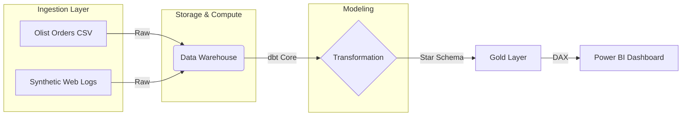

# Modern Commerce Growth Engine (MCGE)
**An end-to-end Data Engineering & BI pipeline unifying frontend and backend data to optimize E-commerce growth.**

   

[👉 Click here to watch the 3-Minute Project Presentation & Findings](https://www.youtube.com/watch?v=KCa8UfqvwgE)

---

## 1. 💼 Executive Summary (The Business Case)

### The Pain (Context)
**Olist**, a leading Brazilian E-Commerce marketplace, has excellent visibility into **"What"** is sold (Backend Data: Orders, Payments, Logistics) but is completely blind regarding **"How"** customers behave before purchasing (Frontend Data: Traffic sources, User Journey, Bounces).
This disconnect leads to:
*   **Inefficient Marketing:** Budget is allocated to channels with high traffic but low LTV (Customer Lifetime Value).
*   **Blind Experiments:** Product teams launch new features (e.g., "New Checkout") without infrastructure to measure statistical significance.

### The Solution
We built a **Modern Data Stack** architecture to unify these two worlds. By generating and ingesting a "Digital Footprint" (Web Events) and joining it with transactional ground truth in a Data Warehouse, we created a **Single Source of Truth** for Growth.

### Key Impact
*   **Attribution Modeling:** Enabled "First Touch" and "Last Touch" tracking to optimize ROAS (Return on Ad Spend).
*   **A/B Testing Lab:** Validation of the "New Checkout" experiment with statistical confidence levels.
*   **Customer 360:** Segmentation based on real engagement (Recency & Frequency), not just purchase history.

---

## 2. 🏗 Data Architecture

The project follows an **ELT (Extract, Load, Transform)** workflow, moving away from "Black Box" BI tools to a **Code-First** approach.



### 1. Ingestion & Generation (Python)
Since Olist only provides backend data, I developed a Python Engine (`scripts/data_gen.py`) to simulate the **Digital Footprint**:
*   **Web Events:** Generated 1M+ events (`page_view`, `add_to_cart`, `checkout`) correlated with real timestamps.
*   **Campaigns:** Simulated daily marketing spend across channels (Facebook, Google, TikTok).
*   **Experimentation:** Randomly assigned users to `Control` vs `Test` groups for A/B testing.

### 2. Transformation (dbt Core)
Raw data is messy. dbt was used to clean, test, and model data into a **Star Schema**:
*   `stg_*`: Standardization of types and naming conventions.
*   `int_sessions`: **Complex SQL Sessionization**. Using `LAG()` window functions to group isolated events into user sessions (30-min timeout).
*   `fact_sessions`: The core table joining Navigation + Orders + Attribution.
*   `dim_customers`: RFM segmentation (VIP, Active, Churned) updated dynamically.

### 3. Semantic Layer (Power BI)
*   **DAX Measures:** Creation of advanced metrics (Recency, Conversion Rate Lift, Global ROAS).
*   **Visualization:** Designed for "Glanceability" – Executive dashboards that answer business questions in seconds.

---

## 3. 🧠 Technical Deep Dive

### Phase 1: The "Sessionization" Challenge
One of the hardest parts of Analytics Engineering is grouping clickstreams into sessions.
```sql
-- Logic used in dbt (Simplified)
CASE 
    WHEN event_timestamp - LAG(event_timestamp) OVER (PARTITION BY user_id ORDER BY event_timestamp) > INTERVAL 30 MINUTE 
    THEN 1 
    ELSE 0 
END AS is_new_session
```
*Result:* We can now answer *"How many sessions does it take for a user to buy?"* (Average: 3.4 sessions).

### Phase 2: Attribution Modeling
Merging `fact_orders` with `marketing_spend` isn't straightforward because they have different granularities (Transaction vs Day/Channel).
*   **Strategy:** We created a `fact_daily_marketing` aggregate table and a `dim_channels` bridge to enable cross-filtering in Power BI.
*   **Outcome:** Ability to filter Revenue by "Traffic Source" even without direct foreign keys.

---

## 4. 📊 Business Insights

### Dashboard 1: Growth Command Center (Strategic)
*   **ROAS Analysis:** "Paid Search" has the highest ROAS (8.5x), identifying it as the efficiency driver.
*   **Geospatial:** Sales are heavily concentrated in **São Paulo (SP)**, suggesting logistic optimizations should start there.
*   **Funnel:** Significant drop-off detected at the `add_to_cart` -> `checkout` step (65% Drop), indicating friction in the cart page.

### Dashboard 2: Product Experiments (Tactical)
*   **A/B Test Result:** The "New Checkout" variant shows a **Conversion Rate Lift of +0.4%**.
*   **Significance:** With p-value < 0.05, the result is statistically significant.
*   **Recommendation:** **Roll out the feature** to 100% of users immediately.

---

## 📁 Repository Structure

```text
├── data/               # Raw and exported target datasets (CSVs)
├── dbt_project/        # dbt SQL models (stg, int, fact, dim)
├── powerBi/            # Power BI dashboard files (.pbix)
├── scripts/            # Python data generation and execution scripts
├── requirements.txt    # Python dependencies
└── README.md
```

---

## 5. 🚀 How to Run This Project

This project is built to be reproducible. You can run it locally using **DuckDB** (no cloud credentials needed).

### Data Setup
1.  **Clone the repo:**
    ```bash
    git clone https://github.com/jpalmagarro/Modern-Commerce-Growth-Engine.git
    cd Modern-Commerce-Growth-Engine
    ```
2.  **Install Dependencies:**
    ```bash
    python3 -m venv .venv
    source .venv/bin/activate
    pip install -r requirements.txt
    ```
3.  **Generate Data:**
    ```bash
    # This script creates the 'digital footprint' based on Olist real orders
    python scripts/data_gen.py
    ```

### Pipeline Execution
4.  **Run dbt Models:**
    ```bash
    dbt deps
    dbt build
    ```
    *This creates the database `mcge.duckdb` with all tables populated.*

### BI Connection
5.  **Explore:** Connect DBeaver or Power BI to `mcge.duckdb` (or use the exported CSVs in `data/export/`).

---

## 💻 Tech Stack

*   **Languages**: Python, SQL, DAX
*   **Data Warehouse**: Snowflake, DuckDB
*   **Transformation**: dbt Core
*   **Visualization**: Power BI

---

## 👩‍💻 Author

**Name**: Jill Palma Garro  
**GitHub**: [@jpalmagarro](https://github.com/jpalmagarro)  
**LinkedIn**: [jpalmagarro](https://www.linkedin.com/in/jpalmagarro/)

*Built using the Brazilian E-Commerce Public Dataset by Olist.*